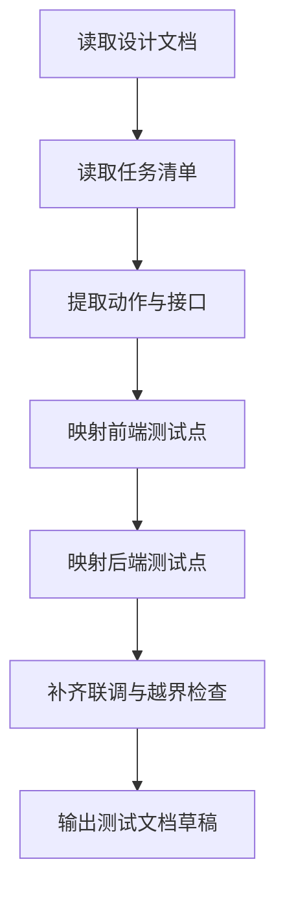

## 输入:

1. 单工具设计文档。
2. 单工具任务清单。
3. 用户对验收重点的补充说明。

## 逻辑：

1. 先读取设计文档中的 group、tool_key、API 契约、页面状态、权限规则。
2. 再读取任务清单中的 FE、BE、INT、QA 任务边界。
3. 将设计文档中的动作、接口、页面状态映射成测试点。
4. 补齐前端测试、后端测试、接口检查、联调检查、越界检查。
5. 输出一份可直接交给测试AI或架构师 test-doc-design 使用的测试文档草稿。

## skill流程:



## 规则：

1. 只围绕单个工具生成测试文档。
2. 每个已定义接口都必须至少有一个测试检查点。
3. 每个已定义关键页面状态都必须至少有一个测试检查点。
4. 必须写出前端测试路径与后端测试路径。
5. 必须写出至少一条主链路联调检查。
6. 必须写出越界检查要求。
7. 最终输出时，只输出测试文档草稿，不附加解释文字。

## 固定输出格式(示例)：

```md
# <tool_key> 测试文档

## 一、工具上下文
- group:
- tool_key:
- frontend_test_root:
- backend_test_root:

## 二、前端测试点
- 路由可访问
- 导航入口可访问
- 核心成功流程

## 三、后端测试点
- 接口成功流程
- 参数校验
- 权限校验

## 四、联调与越界检查
- 登录 -> 侧边栏 -> 工具页面 -> 主操作
- allowed_files 检查
```